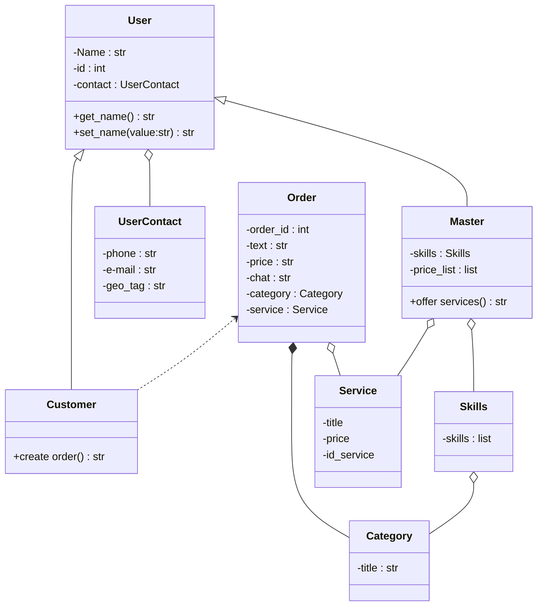

```mermaid

classDiagram
    User <|-- Master
    User <|-- Customer
    User o-- UserContact
    Order *-- Category
    Skills o-- Category
    Master o-- Skills
    Order <.. Customer
    Order o-- Service
    Master o-- Service
class User{
    -Name : str
    -id : int
    -contact : UserContact

    +get_name() str
    +set_name(value:str) str
}
class Master{
    -skills : Skills
    -price_list : list
    +offer services() str 
    
}
class Customer{
    +create order() str
}

class UserContact{
    -phone : str
    -e-mail : str
    -geo_tag : str
}
class Order{
    -order_id : int 
    -text : str
    -price : str
    -chat : str 
    -category : Category
    -service : Service
}

class Category{
    -title : str
    
}

class Skills{
    -skills : list
}

class Service { 
    -title
    -price
    -id_service

}
```
